# IdentityService — Test Documentation

_Last updated: 2026-08-30 · TARIS-013 (in progress, uncommitted on branch `TARIS-013`)_

## 1. What this covers

Every test currently exercising the IdentityService vertical slice: two backend xUnit projects (`aris.IdentityService.UnitTests`, `aris.IdentityService.IntegrationTests`) and one Angular spec file (`auth.service.spec.ts`). This is **as-built** — what each test actually arranges/acts/asserts, right now — not the phase's FR-x.x ↔ Test-ID traceability matrix (Phase 1 Test Documentation, owned by the `fr-techdoc-testdoc-traceability-auditor` agent). Use this doc to find "what does this test actually check," and that agent's audit to find "does every requirement have a test."

Backend doc: see [IdentityService.md](./IdentityService.md) · Frontend doc: see [IdentityService-UI.md](./IdentityService-UI.md)

## 2. Test suites at a glance

| Project / file | Type | What it exercises | Key fixture/harness |
|---|---|---|---|
| `tests/aris.IdentityService.UnitTests/Authentication/AuthenticationServiceTests.cs` | unit | `AuthenticationService`'s login/refresh/logout business logic, in isolation from EF Core/HTTP | Hand-written fakes: `FakeUserRepository`, `FakeRefreshTokenRepository`, `FakePasswordHasher`, `FakeJwtTokenGenerator`, `NullPhiSafeLogger<T>` (all nested private classes in the test file itself) |
| `tests/aris.IdentityService.UnitTests/Security/BCryptPasswordHasherTests.cs` | unit | `BCryptPasswordHasher.Verify` against real BCrypt hashes | none — exercises the real `BCrypt.Net.BCrypt` library directly, no fakes |
| `tests/aris.IdentityService.IntegrationTests/AuthControllerTests.cs` | integration (HTTP) | The full ASP.NET Core pipeline — middleware, `AuthController`, real JWT issuance/validation, EF Core — via an actual `HttpClient` | `TestWebApplicationFactory` : `WebApplicationFactory<Program>`, swapping SQL Server for an in-memory SQLite connection ([TestWebApplicationFactory.cs](../../tests/aris.IdentityService.IntegrationTests/TestWebApplicationFactory.cs)) |
| `apps/aris-web/src/app/core/auth/auth.service.spec.ts` | frontend unit (Angular `TestBed`) | `AuthService.logout()`'s session-clearing and HTTP-call behavior | `HttpTestingController` (Angular's mocked HTTP backend) via `provideHttpClient()` + `provideHttpClientTesting()` |
| `tests/aris.IdentityService.UnitTests/UnitTest1.cs`, `tests/aris.IdentityService.IntegrationTests/UnitTest1.cs` | — | Default `dotnet new xunit` scaffold placeholders (`Test1()` with an empty body) | none — not real tests, not covering anything, left over from project creation |

**Gap worth flagging, not glossed over**: there is currently no frontend spec coverage for `AuthService.login()`, `authInterceptor`, `authGuard`, or `LoginComponent` — only `logout()` is spec-tested. Everything else on the Angular side is only exercised manually / not at all yet.

## 3. Coverage map

```mermaid
graph TD
    Login["Login flow<br/>(IdentityService.md §4)"] --> UT01["UT-ID-01: valid credentials"]
    Login --> UTPw["UT-ID-03: wrong password"]
    Login --> FR12a["FR-1.2: unknown username<br/>= same generic error"]
    Login --> FR12b["FR-1.2: inactive user<br/>= same generic error"]
    Login --> IT01["IT-ID-01: seeded login<br/>returns usable tokens"]
    Login --> IT02["IT-ID-02 / FR-1.2:<br/>wrong password → 401"]
    Login --> IT03b["FR-1.2: unknown username<br/>HTTP-level"]

    Refresh["Refresh/rotate flow<br/>(IdentityService.md §4)"] --> UT04["UT-ID-04: valid rotation"]
    Refresh --> UT05["UT-ID-05: reuse detected<br/>→ whole chain revoked"]
    Refresh --> UTUnk["unknown/blank token<br/>no ID"]
    Refresh --> UTDeact["deactivated user<br/>no ID"]
    Refresh --> IT03["IT-ID-03: rotate + reject reuse"]
    Refresh --> ITUnk["unknown token → 401<br/>no ID"]

    Concurrency["Concurrency guard<br/>(RowVersion, IdentityService.md §3)"] --> ITConc["Refresh_ConcurrentRotationOfSameToken<br/>no ID — only one of two racing<br/>RotateAsync calls succeeds"]

    Logout["Logout flow<br/>(IdentityService.md §4)"] --> LOIssued["FR-1.4: revokes token<br/>just issued"]
    Logout --> LOUnknown["FR-1.4: unknown token<br/>is a silent no-op"]
    Logout --> LOIdem["FR-1.4: called twice<br/>is idempotent"]
    Logout --> LOBlank["FR-1.4: null/blank token<br/>does not throw"]
    Logout --> ITNoBearer["FR-1.4: no bearer token<br/>→ 401"]
    Logout --> ITLO04["IT-ID-04 / FR-1.4: valid bearer +<br/>own token → 204, token revoked"]
    Logout --> ITLOUnk["FR-1.4: unknown token<br/>→ still 204"]
    Logout --> FEClears["frontend: clears session<br/>before /logout settles"]
    Logout --> FEHeaders["frontend: sends refreshToken<br/>+ bearer access token"]
    Logout --> FEFails["frontend: session stays cleared<br/>even if revoke call fails (500)"]
    Logout --> FENoop["frontend: no HTTP call<br/>if no session"]

    Hasher["Password hashing<br/>(BCryptPasswordHasher)"] --> UT03m["UT-ID-03: matching password"]
    Hasher --> UT03n["UT-ID-03: non-matching password"]
```

Every primary flow in [IdentityService.md](./IdentityService.md) §4 has both a unit-level and (except the concurrency guard, which is integration-only by nature) an HTTP-level integration test. The frontend only has coverage for logout — login/refresh/guard/interceptor are untested on the Angular side today.

## 4. Test-by-test detail (grouped by suite/file)

### `AuthenticationServiceTests.cs` (unit)

| Test | Requirement/Test ID | Scenario | Assertion | Where |
|---|---|---|---|---|
| `LoginAsync_WithValidCredentials_ReturnsTokenForCorrectUserAndRoles` | UT-ID-01 | Active admin user, correct password | Success result; access token from the fake generator; correct user id/display name/roles; `MustChangePassword` false; exactly one refresh token added, for the right user | [AuthenticationServiceTests.cs:45-60](../../tests/aris.IdentityService.UnitTests/Authentication/AuthenticationServiceTests.cs) |
| `LoginAsync_WithWrongPassword_ReturnsGenericInvalidCredentialsError` | UT-ID-03 (rejects non-matching password) | Real user, hasher forced to return `false` | Failure with the exact generic message `"Invalid username or password."` | [:62-72](../../tests/aris.IdentityService.UnitTests/Authentication/AuthenticationServiceTests.cs) |
| `LoginAsync_WithUnknownUsername_ReturnsSameGenericErrorAsWrongPassword` | FR-1.2 | No user exists for the given username | Failure with the byte-identical generic message as the wrong-password case (anti-enumeration) | [:74-83](../../tests/aris.IdentityService.UnitTests/Authentication/AuthenticationServiceTests.cs) |
| `LoginAsync_WithInactiveUser_ReturnsSameGenericErrorAsWrongPassword` | FR-1.2 | User exists, correct password, but `IsActive = false` | Same generic failure message — a deactivated account never gets a distinguishable error | [:85-96](../../tests/aris.IdentityService.UnitTests/Authentication/AuthenticationServiceTests.cs) |
| `LogoutAsync_WithTokenIssuedByLogin_RevokesThatToken` | FR-1.4 | Log in, then log out with the token just issued | The issued `RefreshToken`'s `RevokedAtUtc` is set (non-null) | [:98-109](../../tests/aris.IdentityService.UnitTests/Authentication/AuthenticationServiceTests.cs) |
| `LogoutAsync_WithUnknownToken_DoesNotThrowAndRevokesNothing` | FR-1.4 | Log out with a token the repository doesn't recognize | No exception; no added token ends up revoked | [:111-120](../../tests/aris.IdentityService.UnitTests/Authentication/AuthenticationServiceTests.cs) |
| `LogoutAsync_CalledTwiceWithSameToken_IsIdempotent` | FR-1.4 | Log out twice with the same token | `RevokedAtUtc` is identical (unchanged) after the second call | [:122-133](../../tests/aris.IdentityService.UnitTests/Authentication/AuthenticationServiceTests.cs) |
| `LogoutAsync_WithNullOrWhitespaceToken_DoesNotThrow` | FR-1.4 | Call with `null` and with `"   "` | Neither call throws | [:135-142](../../tests/aris.IdentityService.UnitTests/Authentication/AuthenticationServiceTests.cs) |
| `RefreshAsync_WithValidToken_IssuesNewTokenAndRevokesPresentedOne` | UT-ID-04 | Log in, then refresh with the issued token | Success; new refresh token differs from the presented one; exactly 2 tokens added total; old token's `RevokedAtUtc` set and `ReplacedByTokenId` points at the new one; new token's `RevokedAtUtc` is null | [:144-162](../../tests/aris.IdentityService.UnitTests/Authentication/AuthenticationServiceTests.cs) |
| `RefreshAsync_WithAlreadyRotatedToken_IsRejectedAndRevokesAllActiveTokensForUser` | UT-ID-05 | Refresh once (rotating the original token), then present the *original* (now-revoked) token again | Failure with the generic invalid-refresh-token message; **every** token ever added for the user ends up with `RevokedAtUtc` set, not just the reused one | [:164-178](../../tests/aris.IdentityService.UnitTests/Authentication/AuthenticationServiceTests.cs) |
| `RefreshAsync_WithUnknownToken_ReturnsGenericInvalidRefreshTokenError` | — (no ID in comment) | Present a token the repository has never seen | Failure with the generic invalid-refresh-token message | [:180-189](../../tests/aris.IdentityService.UnitTests/Authentication/AuthenticationServiceTests.cs) |
| `RefreshAsync_WithNullOrWhitespaceToken_ReturnsGenericInvalidRefreshTokenError` | — | Call with `null` | Failure with the generic invalid-refresh-token message, no crash | [:191-200](../../tests/aris.IdentityService.UnitTests/Authentication/AuthenticationServiceTests.cs) |
| `RefreshAsync_ForDeactivatedUser_ReturnsGenericInvalidRefreshTokenError` | — | Log in, then deactivate the user (`IsActive = false`), then refresh with the still-unexpired token | Failure with the generic invalid-refresh-token message, even though the token itself is valid | [:202-214](../../tests/aris.IdentityService.UnitTests/Authentication/AuthenticationServiceTests.cs) |

### `BCryptPasswordHasherTests.cs` (unit)

| Test | Requirement/Test ID | Scenario | Assertion | Where |
|---|---|---|---|---|
| `Verify_WithMatchingPassword_ReturnsTrue` | UT-ID-03 | Real BCrypt hash of `"Admin@12345"`, verify with the same password | Returns `true` | [BCryptPasswordHasherTests.cs:9-15](../../tests/aris.IdentityService.UnitTests/Security/BCryptPasswordHasherTests.cs) |
| `Verify_WithNonMatchingPassword_ReturnsFalse` | UT-ID-03 | Same hash, verify with `"wrong-password"` | Returns `false` | [:17-23](../../tests/aris.IdentityService.UnitTests/Security/BCryptPasswordHasherTests.cs) |

### `AuthControllerTests.cs` (integration, real HTTP over `TestWebApplicationFactory`)

| Test | Requirement/Test ID | Scenario | Assertion | Where |
|---|---|---|---|---|
| `Login_WithSeededValidCredentials_ReturnsOkWithUsableTokens` | IT-ID-01 | `POST /identity/login` with the seeded `admin`/`Admin@12345` | 200 OK; non-blank access+refresh tokens; correct display name/roles; `mustChangePassword` false; the access token independently validates against the app's own resolved signing key, with the right `sub` claim | [AuthControllerTests.cs:28-66](../../tests/aris.IdentityService.IntegrationTests/AuthControllerTests.cs) |
| `Login_WithWrongPassword_ReturnsGenericUnauthorizedProblemDetails` | IT-ID-02 (courtesy, FR-1.2) | Wrong password | 401; problem-details body contains `"Invalid username or password."` | [:68-78](../../tests/aris.IdentityService.IntegrationTests/AuthControllerTests.cs) |
| `Login_WithUnknownUsername_ReturnsSameGenericResponseAsWrongPassword` | FR-1.2 | Compares the wrong-password response to an unknown-username response | Same status code; identical `type`/`title`/`status`/`detail` fields (traceId intentionally excluded from the comparison) | [:80-99](../../tests/aris.IdentityService.IntegrationTests/AuthControllerTests.cs) |
| `Refresh_WithValidRefreshToken_ReturnsNewTokenPairAndRejectsReuseOfTheOldOne` | IT-ID-03 | Login, refresh, then replay the original token, then replay the *new* token too | Refresh returns 200 with a different refresh token; replaying the original returns 401; replaying the refresh's own new token *also* returns 401 (proves whole-chain revocation reaches tokens issued by the refresh itself) | [:101-121](../../tests/aris.IdentityService.IntegrationTests/AuthControllerTests.cs) |
| `Refresh_ConcurrentRotationOfSameToken_OnlyOneRotationSucceeds` | — | Two separate DI scopes/DbContexts both read the same active token, then both call `RotateAsync` against it, simulating two racing `/refresh` requests | Exactly one `RotateAsync` call returns `true`; the other returns `false` (the `DbUpdateConcurrencyException` → `false` path in `RefreshTokenRepository`) | [:123-159](../../tests/aris.IdentityService.IntegrationTests/AuthControllerTests.cs) |
| `Refresh_WithUnknownToken_ReturnsUnauthorized` | — | Unrecognized token | 401, no crash | [:161-169](../../tests/aris.IdentityService.IntegrationTests/AuthControllerTests.cs) |
| `Logout_WithoutBearerToken_ReturnsUnauthorized` | FR-1.4 | `POST /identity/logout` with no `Authorization` header | 401 — confirms `[Authorize]` is actually enforced on this endpoint | [:171-179](../../tests/aris.IdentityService.IntegrationTests/AuthControllerTests.cs) |
| `Logout_WithValidBearerAndOwnRefreshToken_RevokesTokenAndReturnsNoContent` | IT-ID-04 / FR-1.4 | Login, then logout with a valid bearer + the refresh token from that same login | 204; the token's `RevokedAtUtc` is set in the DB; a subsequent refresh attempt with that same token then fails with 401 | [:181-201](../../tests/aris.IdentityService.IntegrationTests/AuthControllerTests.cs) |
| `Logout_WithUnknownRefreshToken_StillReturnsNoContent` | FR-1.4 | Valid bearer, but a refresh token the server has never issued | 204 (silent no-op — logout must not leak token validity) | [:203-214](../../tests/aris.IdentityService.IntegrationTests/AuthControllerTests.cs) |

### `auth.service.spec.ts` (frontend unit, Angular `TestBed`)

| Test | Requirement/Test ID | Scenario | Assertion | Where |
|---|---|---|---|---|
| `clears the session synchronously, before the /identity/logout call settles` | — | Log in (mocked), then call `logout()` before flushing the mocked HTTP response | `isAuthenticated()`/`getAccessToken()`/`currentUser()` are already cleared *before* the `/identity/logout` mock request is flushed | [auth.service.spec.ts:36-47](../../apps/aris-web/src/app/core/auth/auth.service.spec.ts) |
| `sends the refresh token and the pre-clear access token as bearer auth to /identity/logout` | — | Log in, then log out | The outgoing `/identity/logout` request body is `{ refreshToken: 'refresh-token' }` and carries `Authorization: Bearer access-token` — proving the access token is captured *before* being cleared | [:49-58](../../apps/aris-web/src/app/core/auth/auth.service.spec.ts) |
| `leaves the session cleared even when the revoke call fails` | — | Log in, log out, then flush the mocked `/identity/logout` call as a 500 | Session remains cleared (`isAuthenticated()` still `false`) despite the failed backend call | [:60-71](../../apps/aris-web/src/app/core/auth/auth.service.spec.ts) |
| `does not call /identity/logout when there is no session to log out of` | — | Call `logout()` with no prior login | No HTTP request to `/identity/logout` is made at all | [:73-77](../../apps/aris-web/src/app/core/auth/auth.service.spec.ts) |

### Scaffold placeholders (not real tests)

`tests/aris.IdentityService.UnitTests/UnitTest1.cs` and `tests/aris.IdentityService.IntegrationTests/UnitTest1.cs` are both the default `dotnet new xunit` template — a single `Test1()` with an empty body. They don't exercise anything and aren't part of this coverage picture; left as-is from project scaffolding rather than removed.
