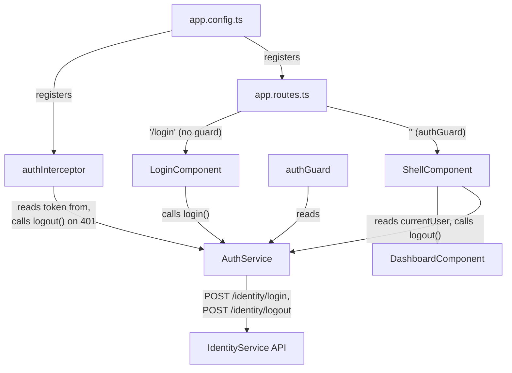
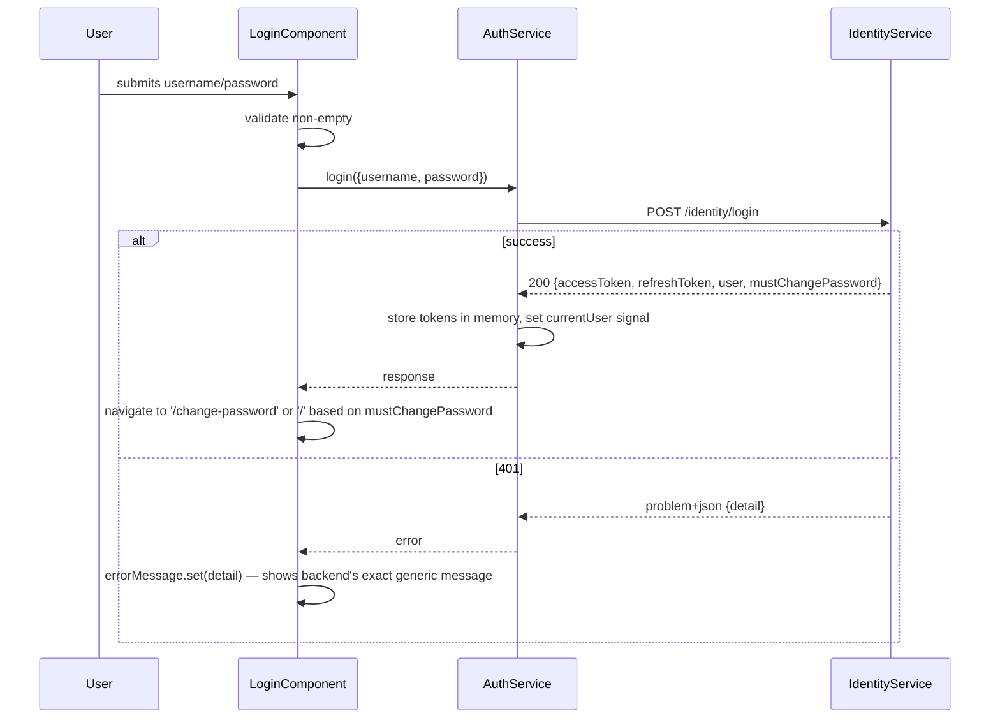
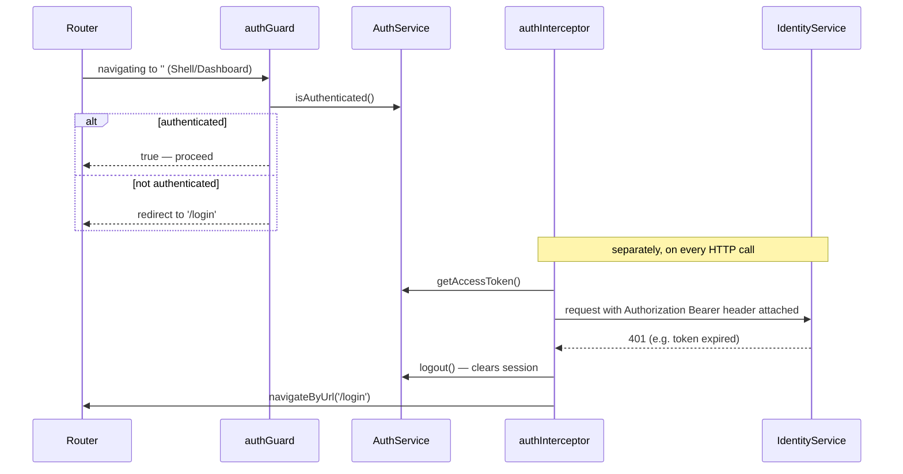

# IdentityService UI — Implementation Log & Architecture Guide

_Last updated: 2026-08-30 · TARIS-012 (current on disk — TARIS-013's backend refresh endpoint is not yet consumed here; see §5's "not yet done" note)_

## 1. What this is for

The login/session/shell slice of the Angular workspace `apps/aris-web` — the frontend half of the Identity vertical slice. It provides the login page, the in-memory session (access + refresh token, current-user signal), the HTTP interceptor that attaches the bearer token and reacts to 401s, the route guard gating the authenticated area, and the shell chrome (user menu + logout) that all consume IdentityService's `/identity/login` and `/identity/logout` endpoints.

Backend counterpart: see [IdentityService.md](./IdentityService.md) for the endpoint contracts and server-side auth/rotation logic this code calls. Test coverage: see [IdentityService-Tests.md](./IdentityService-Tests.md) for what every backend and frontend test actually verifies.

## 2. Architecture at a glance

Everything lives under `apps/aris-web/src/app/`:

- **`core/auth/`** — `AuthService` (session state + the `login`/`logout` HTTP calls) and `auth.models.ts` (TypeScript interfaces mirrored field-for-field from the backend's `Authentication` DTOs).
- **`core/interceptors/`** — `authInterceptor`, a functional `HttpInterceptorFn` that attaches the bearer token to every request and reacts to a 401 by logging out and redirecting.
- **`core/guards/`** — `authGuard`, a functional `CanActivateFn` that blocks the authenticated route tree unless `AuthService.isAuthenticated()`.
- **`core/layout/`** — `ShellComponent`, the authenticated chrome (user menu showing name/role/initials, logout button) wrapping `<router-outlet>`.
- **`features/login/`** — `LoginComponent`, the only route reachable while unauthenticated.
- **`features/dashboard/`** — a placeholder landing page rendered inside the shell; not identity-specific itself, just the current default child route.



Plain-text summary:

```
app.config.ts       -> registers authInterceptor (provideHttpClient) and the router (provideRouter)
app.routes.ts        -> '/login' -> LoginComponent (unguarded)
                      -> ''      -> ShellComponent (authGuard) -> DashboardComponent (child)
core/auth/AuthService <- LoginComponent (login), ShellComponent (currentUser, logout),
                          authGuard (isAuthenticated), authInterceptor (getAccessToken, logout)
core/auth/AuthService -> HTTP POST /identity/login, /identity/logout  (IdentityService.md)
```

## 3. Design patterns & tech-stack building blocks in use

| Pattern / tech item | Where | Why it's used here |
|---|---|---|
| Signal-based reactive state | `AuthService._currentUser` (private `signal`) / `currentUser` (`asReadonly()`) / `isAuthenticated` (`computed`) — [auth.service.ts:14-16](../../apps/aris-web/src/app/core/auth/auth.service.ts); `ShellComponent`'s `userName`/`roleLabel`/`userInitials` computed signals | Session state is exposed as a readonly signal + computed values instead of an `Observable`/`BehaviorSubject`, so template bindings re-render on change with no `async` pipe needed. |
| In-memory-only token storage | `AuthService.accessToken`/`refreshToken` private fields ([auth.service.ts:11-12](../../apps/aris-web/src/app/core/auth/auth.service.ts)) | Tokens live only in the service instance's memory, never `localStorage`/`sessionStorage` — reduces XSS exfiltration surface (Technical Documentation §6.3) at the cost of the session not surviving a page reload. |
| Functional interceptor / guard (Angular's function-based DI style) | `authInterceptor` ([auth.interceptor.ts](../../apps/aris-web/src/app/core/interceptors/auth.interceptor.ts)), `authGuard` ([auth.guard.ts](../../apps/aris-web/src/app/core/guards/auth.guard.ts)) | Both use `inject()` inside a plain function instead of an injectable class, registered via `provideHttpClient(withInterceptors([authInterceptor]))` and `canActivate: [authGuard]` — the current idiomatic Angular standalone-app style, no `NgModule` involved anywhere in this app. |
| Hand-mirrored DTO convention | `auth.models.ts:1-2` | The file opens with an explicit comment that its interfaces mirror `aris.IdentityService.Application.Authentication.{LoginRequestDto, LoginResponseDto, LoginUserDto}` exactly — kept in sync by hand across the two codebases/languages, not generated from a shared schema. |
| Fail-closed logout | `AuthService.logout()` ([auth.service.ts:30-52](../../apps/aris-web/src/app/core/auth/auth.service.ts)) | Local session state (`accessToken`, `refreshToken`, `_currentUser`) is cleared **before** the best-effort backend revoke call fires, so the UI becomes unauthenticated even if that network call fails, is slow, or never completes — the access token to attach is captured into a local variable first, since by request time `authInterceptor` would otherwise find the field already `null`. |
| Anti-enumeration message passthrough | `LoginComponent.handleSubmit`'s error handler ([login.component.ts:52-58](../../apps/aris-web/src/app/features/login/login.component.ts)) | Renders the backend's exact `ProblemDetails.detail` string rather than a client-composed message, so the UI can't accidentally say something more specific than the backend's deliberately generic FR-1.2 wording. |
| Session-loss-triggered logout on 401 | `authInterceptor`'s `catchError` ([auth.interceptor.ts:19-30](../../apps/aris-web/src/app/core/interceptors/auth.interceptor.ts)) | Any non-login request that comes back 401 clears the session and redirects to `/login`; a failed `/identity/login` attempt itself is explicitly excluded (`isLoginRequest` check) since that's a credentials error `LoginComponent` handles directly, not a session invalidation. |

## 4. Key flows

### Login



### Authenticated navigation + forced logout on 401



**No silent-refresh retry exists yet** — a 401 goes straight to logout + redirect. That's the gap called out in §5 below.

## 5. Implementation log (newest first)

### TARIS-012 — Logout wiring (merged via PR #5, commit `011581d`)

- **`auth.models.ts`** — added `LogoutRequest` interface (`{ refreshToken: string }`), mirroring the backend's new `LogoutRequestDto`.
- **`auth.service.ts`** — added `AuthService.logout()`. See §3's "fail-closed logout" row for exactly how it sequences clearing local state vs. firing the backend call; the backend call is `.pipe(catchError(() => of(void 0)))`, so a failed/slow revoke never throws back into the caller.
- **`shell.component.ts`** — added the `logout()` method (calls `AuthService.logout()`, closes the user menu, navigates to `/login`), wired to the shell's user-menu logout button.
- **`auth.service.spec.ts`** (new) — unit tests for the new `logout()` behavior.
- Backend side of this same ticket: see [IdentityService.md](./IdentityService.md) §5 TARIS-012 entry — the `/identity/logout` endpoint this calls.

### TARIS-011 — Angular workspace scaffold + login-only slice (merged via PR #4, commit `140bb4c`)

The entire `apps/aris-web` Angular workspace was created in this commit (standalone-components style, no `NgModule`), along with the login-only auth slice:

- **`auth.models.ts`** (new) — `LoginRequest`, `LoginUser`, `LoginResponse`, `ProblemDetails` interfaces (no `LogoutRequest` yet — added by TARIS-012).
- **`auth.service.ts`** (new) — `AuthService` with `login()` only (no `logout()` yet), in-memory token fields, the `currentUser`/`isAuthenticated` signals.
- **`auth.guard.ts`** (new) — `authGuard`.
- **`auth.interceptor.ts`** (new) — `authInterceptor`, attaching the bearer token and redirecting to `/login` on 401 — already present at this point, but with **no silent-refresh retry**, since the backend `/identity/refresh` endpoint didn't exist yet (see the code's own comment, still accurate today — refresh wasn't added until TARIS-013, and even now the interceptor hasn't been updated to use it).
- **`login.component.ts`/`.html`/`.scss`** (new) — the login form: username/password fields, show/hide password toggle, submitting/error signals, navigates to `/` (or `/change-password`, unreachable today since the seeded admin has `mustChangePassword: false` and that route doesn't exist yet) on success.
- **`shell.component.ts`/`.html`/`.scss`** (new) — the authenticated chrome: user menu (name/role/initials derived from `AuthService.currentUser`), hamburger menu toggle. No logout button wired yet at this point (added by TARIS-012).
- **`dashboard.component.*`** (new) — placeholder landing page, not identity-specific.
- **`app.routes.ts`/`app.config.ts`** (new) — route table (`/login` unguarded, `''` behind `authGuard` wrapping `ShellComponent`/`DashboardComponent`) and the interceptor/router provider registration.
- **`shared/icons/icon.component.ts`** (new) — small reusable icon component used by login/shell.
- Backend side of this same ticket: see [IdentityService.md](./IdentityService.md) §5 TARIS-011 entry — the `/identity/login` endpoint this calls.

### Not yet done (as of this doc's last update)

- **The frontend does not yet call `/identity/refresh`.** TARIS-013's backend work (see [IdentityService.md](./IdentityService.md) §5) added the endpoint, but it's uncommitted and the UI side hasn't been touched — `authInterceptor` still goes straight from a 401 to logout + redirect, with no attempt to retry once via a silent refresh first. This is a genuine, current gap between the two sides of this vertical slice (not an oversight in this doc) and is the natural next piece of TARIS-013 (or a follow-up ticket) to close.
- No forced-password-change route (`/change-password`) exists yet — `LoginComponent` already branches on `mustChangePassword`, but the destination route isn't built (FR-6.16, a separate ticket).
