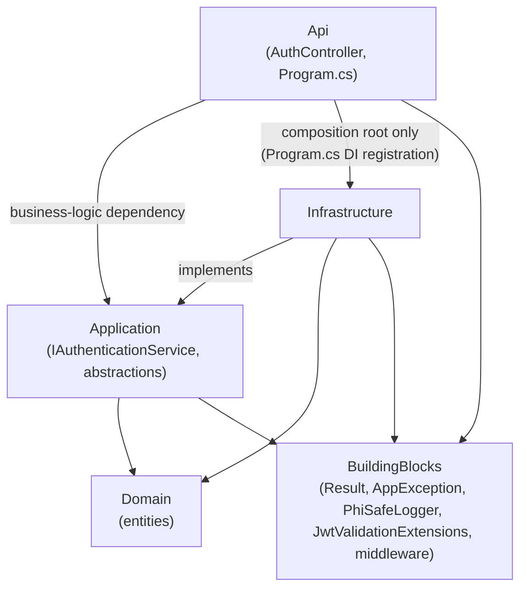
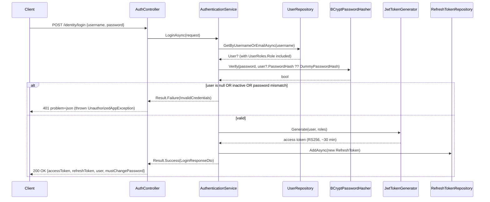
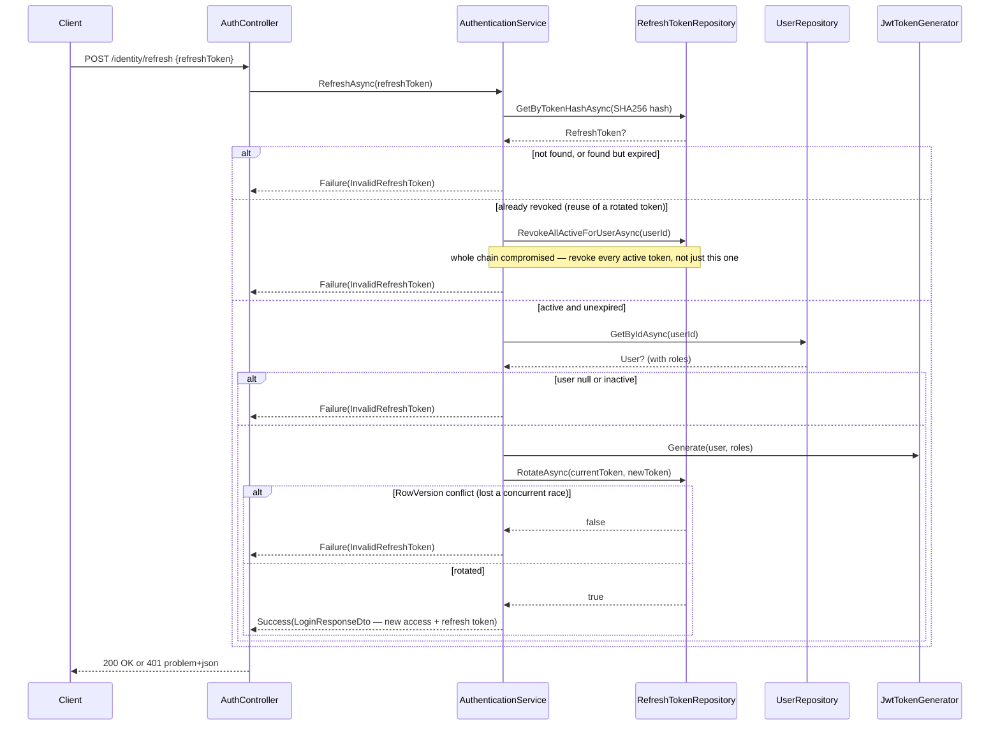
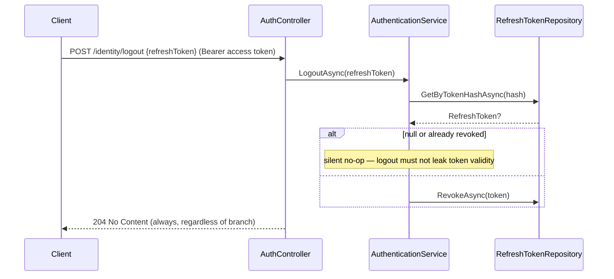

# IdentityService — Implementation Log & Architecture Guide

_Last updated: 2026-08-30 · TARIS-013 (in progress, uncommitted on branch `TARIS-013`)_

## 1. What this is for

IdentityService is ARIS's authentication foundation — Phase 1's "Identity first" non-negotiable. It owns `IdentityDb` exclusively (SQL Server in Docker/production; an in-memory SQLite substitution in integration tests) and is the only service that ever reads or writes `Users`, `Roles`, `UserRoles`, `RefreshTokens`.

As it stands today, only the **authentication slice** is built: login (`POST /identity/login`), refresh-token rotation (`POST /identity/refresh`), and logout (`POST /identity/logout`). Full user management (create/list/get/change-roles/deactivate/reactivate/bulk-import — FR §3.6) and password-reset flows are specified in the Phase 1 docs but not implemented yet — `IUserRepository` currently exposes only two read methods (`GetByUsernameOrEmailAsync`, `GetByIdAsync`), nothing for writes.

Frontend counterpart: see [IdentityService-UI.md](./IdentityService-UI.md) for the Angular login/session/shell code that consumes these three endpoints. Test coverage: see [IdentityService-Tests.md](./IdentityService-Tests.md) for what every backend and frontend test actually verifies.

## 2. Architecture at a glance

Clean Architecture, four projects under `src/Services/IdentityService/`:

- **Api** (`aris.IdentityService.Api`) — the ASP.NET Core host. `Controllers/AuthController.cs` is the only controller; `Program.cs` is the composition root.
- **Application** (`aris.IdentityService.Application`) — `Authentication/IAuthenticationService` + `AuthenticationService`, the request/response DTOs, and the `Abstractions/` interfaces (`IUserRepository`, `IRefreshTokenRepository`, `IPasswordHasher`, `IJwtTokenGenerator`). No EF Core or ASP.NET reference — this project only knows about `aris.BuildingBlocks.Results.Result` and the Domain entities.
- **Domain** (`aris.IdentityService.Domain`) — `User`, `Role`, `UserRole`, `RefreshToken`, all extending `BuildingBlocks.Entities.BaseEntity<TId>` (Id/CreatedAtUtc/CreatedBy/ModifiedAtUtc/ModifiedBy).
- **Infrastructure** (`aris.IdentityService.Infrastructure`) — `Persistence/IdentityDbContext` + EF `IEntityTypeConfiguration<T>` classes + migrations, `Repositories/UserRepository` + `RefreshTokenRepository`, `Security/BCryptPasswordHasher` + `JwtTokenGenerator` + `ArisSigningKeyProvider`, and `DependencyInjection.AddIdentityInfrastructure` which wires all of the above into DI.



Plain-text fallback of the same shape:

```
Api            -> Application (interfaces/DTOs it calls)
Api            -> Infrastructure (Program.cs composition root only — AddIdentityInfrastructure)
Infrastructure -> Application (implements its abstractions)
Infrastructure -> Domain
Application    -> Domain
Api, Application, Infrastructure -> BuildingBlocks (Result, AppException, PhiSafeLogger,
                                                     JwtValidationExtensions, request-pipeline middleware)
```

Domain has zero outward dependencies (the Clean Architecture dependency rule), and `Api` never references `Infrastructure`'s concrete repository/security classes directly outside `Program.cs` — every runtime call from a controller goes through an `Application`-layer interface.

## 3. Design patterns & tech-stack building blocks in use

| Pattern / tech item | Where | Why it's used here |
|---|---|---|
| Clean Architecture / Dependency Inversion | all 4 projects | `Application` defines `IUserRepository`/`IRefreshTokenRepository`/`IPasswordHasher`/`IJwtTokenGenerator`; `Infrastructure` implements them; `DependencyInjection.AddIdentityInfrastructure` ([DependencyInjection.cs:15-35](../../src/Services/IdentityService/aris.IdentityService.Infrastructure/DependencyInjection.cs)) wires concrete types to interfaces so `AuthController` only ever depends on `IAuthenticationService`. |
| Result pattern (BuildingBlocks) | `AuthenticationService.LoginAsync`/`RefreshAsync` return `Result<LoginResponseDto>` ([AuthenticationService.cs:47,78](../../src/Services/IdentityService/aris.IdentityService.Application/Authentication/AuthenticationService.cs)) | Expected failures (bad credentials, invalid/expired/reused token) are values, not exceptions; `AuthController` checks `result.IsFailure` and throws `UnauthorizedAppException` only at the HTTP boundary ([AuthController.cs:25-28,39-42](../../src/Services/IdentityService/aris.IdentityService.Api/Controllers/AuthController.cs)). |
| Problem-details / exception-to-HTTP mapping (BuildingBlocks) | `AppException` subclasses + `ExceptionHandlingMiddleware` | Every thrown `AppException` (and any other unhandled exception) is centrally translated to `application/problem+json` with a `traceId`, so no controller ever builds a `ProblemDetails` object by hand — see [ExceptionHandlingMiddleware.cs:19-59](../../src/BuildingBlocks/aris.BuildingBlocks/Middleware/ExceptionHandlingMiddleware.cs). |
| Repository pattern | `UserRepository`, `RefreshTokenRepository` | Isolates `AuthenticationService` from EF Core entirely; both `GetByUsernameOrEmailAsync` and `GetByIdAsync` eagerly `.Include(UserRoles).ThenInclude(Role)` ([UserRepository.cs:17-33](../../src/Services/IdentityService/aris.IdentityService.Infrastructure/Repositories/UserRepository.cs)) because role names are always needed together with the user for JWT claim generation. |
| App-managed optimistic concurrency (`RowVersion`) | `RefreshToken.RowVersion`, `RefreshTokenConfiguration.Property(...).IsConcurrencyToken()` ([RefreshTokenConfiguration.cs:15-19](../../src/Services/IdentityService/aris.IdentityService.Infrastructure/Persistence/Configurations/RefreshTokenConfiguration.cs)), every write in `RefreshTokenRepository` | Every mutating call (`RevokeAsync`, `RotateAsync`, `RevokeAllActiveForUserAsync`) manually re-randomizes `RowVersion` to `Guid.NewGuid().ToByteArray()` rather than using EF's native `IsRowVersion()`, so the concurrency guard behaves identically on SQL Server and the SQLite substitution the integration tests use (SQLite has no auto-updating rowversion column type). `RotateAsync` catches `DbUpdateConcurrencyException` and returns `false` instead of throwing ([RefreshTokenRepository.cs:35-54](../../src/Services/IdentityService/aris.IdentityService.Infrastructure/Repositories/RefreshTokenRepository.cs)). |
| Refresh-token rotation with reuse detection | `AuthenticationService.RefreshAsync` ([AuthenticationService.cs:78-139](../../src/Services/IdentityService/aris.IdentityService.Application/Authentication/AuthenticationService.cs)) | Every refresh token is single-use: a successful refresh atomically revokes the presented token and inserts its replacement (`RotateAsync`). Presenting a token that's *already* revoked is treated as evidence the chain was captured/replayed, and revokes every other active token for that user via `RevokeAllActiveForUserAsync` — not just the one presented (the `CLAUDE.md` refresh-token-reuse rule). |
| Anti-enumeration login | `AuthenticationService.LoginAsync`'s `DummyPasswordHash` constant ([AuthenticationService.cs:18-22,51](../../src/Services/IdentityService/aris.IdentityService.Application/Authentication/AuthenticationService.cs)) | An unknown username still runs a real BCrypt verification against a fixed dummy hash, so "no such user" and "wrong password" cost the same time and return the byte-identical problem-details body (FR-1.2) — verified directly by `Login_WithUnknownUsername_ReturnsSameGenericResponseAsWrongPassword` in the integration tests. |
| Manual config resolution (no `IOptions<T>` yet) | `JwtTokenGenerator`, `ArisSigningKeyProvider`, `JwtValidationExtensions` (BuildingBlocks), `DependencyInjection.AddIdentityInfrastructure` | JWT issuer/audience/expiry and the RSA signing key are read directly from `IConfiguration` at construction/startup, with a Development-only ephemeral-key fallback and a hard `InvalidOperationException` outside Development if unset ([ArisSigningKeyProvider.cs:27-56](../../src/Services/IdentityService/aris.IdentityService.Infrastructure/Security/ArisSigningKeyProvider.cs)) — no strongly-typed options class exists yet. |
| Shared RS256 signing key, resolved once | `Program.cs:26-30` | The key pair is resolved and its public half written back into `Jwt:PublicKeyPem` configuration **before** `AddArisJwtBearerValidation` runs, so IdentityService's own JWT bearer validation accepts the exact tokens it just signed — without this ordering, Development would mint two unrelated ephemeral keys and IdentityService couldn't validate its own tokens. |
| PHI-safe structured logging (BuildingBlocks) | every `_logger.Log*` call in `AuthenticationService` | Only `user.Id` (a GUID) is ever logged — never username, email, or display name — via `IPhiSafeLogger<T>` ([PhiSafeLogger.cs:13-18](../../src/BuildingBlocks/aris.BuildingBlocks/Logging/PhiSafeLogger.cs)), which forces templated logging but doesn't itself inspect argument content. |
| Correlation ID + centralized exception handling (BuildingBlocks) | `Program.cs:50` `app.UseArisRequestPipeline()` | Every response carries `X-Correlation-Id` (generated if the caller didn't send one); every unhandled exception is caught once, not per-controller. |
| Forced-password-change gate (BuildingBlocks, cross-cutting) | `Program.cs:60` `app.UseArisForcedPasswordChangeGate()`, allow-list in `ForcedPasswordChangeMiddleware` | `/identity/refresh` and `/identity/logout` are allow-listed so a user flagged `must_change_password` can still refresh their session or log out without being locked out of every route (`/identity/login` is pre-auth and needs no allow-listing). |
| EF Core `HasData` seeding + startup migration | `UserConfiguration`, `RoleConfiguration`, `UserRoleConfiguration`, `Program.cs:38-48` | Seeds the 6 roles and one dev-only admin account (`admin` / `Admin@12345`) via migrations; `Program.cs` calls `dbContext.Database.Migrate()` at startup (skipped when the provider isn't SQL Server, i.e. the SQLite test substitution) so `docker compose up` produces a working, seeded database with no manual `dotnet ef database update` step. |

## 4. Key flows

### Login (`POST /identity/login`)



### Refresh / rotate (`POST /identity/refresh`)



### Logout (`POST /identity/logout`, requires `[Authorize]`)



## 5. Implementation log (newest first)

### TARIS-013 — Refresh-token rotation with reuse detection & optimistic concurrency (2026-08-30, uncommitted on branch `TARIS-013`)

This is the branch's current, not-yet-committed work. It adds the entire `/identity/refresh` endpoint on top of TARIS-012's login+logout baseline.

- **`RefreshRequestDto.cs`** (new) — `record RefreshRequestDto(string RefreshToken)`, Application layer. Replaces what would otherwise be a raw string body parameter, matching `LoginRequestDto`/`LogoutRequestDto`'s existing DTO convention.
- **`AuthController.cs`** — added `[HttpPost("refresh")] [AllowAnonymous] Refresh(...)`, calling `_authenticationService.RefreshAsync` and mapping `IsFailure` to `UnauthorizedAppException`, identical shape to `Login`. Anonymous because a refresh call is inherently pre-(access-token)-auth — protected instead by token possession + expiry + single-use rotation, not a role check.
- **`IAuthenticationService.cs` / `AuthenticationService.cs`** — added `RefreshAsync(string? refreshToken, CancellationToken)`. See §4's Refresh sequence diagram above for the full branch logic (reuse detection, expiry, deactivated-user check, rotation). Also extracted the role-name projection duplicated between `LoginAsync` and the new `RefreshAsync` into a shared `GetRoleNames(User)` helper.
- **`IUserRepository.cs` / `UserRepository.cs`** — added `GetByIdAsync(Guid id, ...)`, needed because `RefreshAsync` only has the token's `UserId`, not a username, to re-fetch the user (with roles) after validating the token.
- **`IRefreshTokenRepository.cs` / `RefreshTokenRepository.cs`** — added `RotateAsync(RefreshToken currentToken, RefreshToken newToken, ...)` and `RevokeAllActiveForUserAsync(Guid userId, ...)`. `RotateAsync` is the one place in the codebase that catches `DbUpdateConcurrencyException` on purpose (see §3's optimistic-concurrency row).
- **`RefreshToken.cs`** (Domain) — added `public byte[]? RowVersion { get; set; }`.
- **`RefreshTokenConfiguration.cs`** — added `.IsConcurrencyToken()` on `RowVersion`, with a code comment explaining why it's app-managed rather than EF's native `IsRowVersion()` (provider-portability, see §3).
- **`20260829215435_AddRefreshTokenRowVersion.{cs,Designer.cs}`** (new migration) + updated `IdentityDbContextModelSnapshot.cs` — adds the nullable `varbinary(max) RowVersion` column to `RefreshTokens`.
- **Tests** — `AuthenticationServiceTests.cs` gained `RefreshAsync_*` cases (valid rotation, reuse-detected chain revocation, unknown/blank token, deactivated user); `AuthControllerTests.cs` gained the equivalent HTTP-level cases plus `Refresh_ConcurrentRotationOfSameToken_OnlyOneRotationSucceeds`, which opens two separate DI scopes/DbContexts to genuinely race two `RotateAsync` calls against the same token row and asserts exactly one wins.

**Not yet done, and worth flagging explicitly**: the Angular frontend has *not* been updated for this endpoint yet — `authInterceptor` still has no silent-refresh-on-401 retry logic, and its own code comment still says `/identity/refresh` "doesn't exist yet." See [IdentityService-UI.md](./IdentityService-UI.md) §5's "not yet done" note — this is a real, current gap between the two sides of the vertical slice, not an oversight in this doc.

**Follow-ups this doc doesn't replace**: the concurrency/rotation logic here is exactly the `auth-session-security-reviewer` agent's territory — worth a pass before this branch merges. `/identity/refresh` and `/identity/logout` should also be confirmed in the RBAC matrix (`aris-rbac-matrix-sync`) — `refresh` is `anonymous`, `logout` is `✓ (self)` per the markers that skill already establishes.

### TARIS-012 — Logout and refresh-token revocation (merged via PR #5, commit `011581d`)

- **`AuthController.cs`** — added `[HttpPost("logout")] [Authorize] Logout(...)`. Unlike login/refresh, this endpoint requires a valid access token — logout is an authenticated action on your *own* session, not a pre-auth one.
- **`LogoutRequestDto.cs`** (new) — `record LogoutRequestDto(string RefreshToken)`.
- **`IAuthenticationService.cs` / `AuthenticationService.cs`** — added `LogoutAsync(string? refreshToken, CancellationToken)`. Deliberately a no-op (not an error) for a null/blank/unknown/already-revoked token — see §4's Logout diagram; the point is that logout must never become an oracle for "is this refresh token still valid."
- **`IRefreshTokenRepository.cs` / `RefreshTokenRepository.cs`** — added `RevokeAsync(RefreshToken refreshToken, ...)`, setting `RevokedAtUtc`.
- **Frontend**: `AuthService.logout()` added to `auth.service.ts` — clears local session state (`accessToken`/`refreshToken`/`_currentUser`) *before* firing a best-effort, error-swallowed `POST /identity/logout` call, and `ShellComponent`'s user-menu logout button wired to call it then navigate to `/login`. See [IdentityService-UI.md](./IdentityService-UI.md) for the frontend side in full.

### TARIS-011 — IdentityService scaffold: login, JWT issuance, seeded roles (merged via PR #4, commits `c2b1799` + `140bb4c`)

The foundational commit — Clean Architecture project layout, BuildingBlocks wiring, and the login-only auth slice:

- **BuildingBlocks** additions used from day one: `BaseEntity<TId>`, `Result`/`Result<T>`, `AppException` hierarchy, `ExceptionHandlingMiddleware`, `CorrelationIdMiddleware`, `ForcedPasswordChangeMiddleware`, `PhiSafeLogger<T>`, `JwtValidationExtensions.AddArisJwtBearerValidation`, `ArisHealthCheckExtensions`.
- **Domain**: `User`, `Role`, `UserRole`, `RefreshToken` entities (without `RowVersion` at this point — added later by TARIS-013).
- **Application**: `IAuthenticationService`/`AuthenticationService` with `LoginAsync` only; `LoginRequestDto`/`LoginResponseDto`/`LoginUserDto`; the four `Abstractions/` interfaces (`RefreshAsync`/`GetByIdAsync` didn't exist yet — added by TARIS-013).
- **Infrastructure**: `IdentityDbContext` + all four `IEntityTypeConfiguration` classes (including the `HasData` seeding of 6 roles + one dev admin), `UserRepository` (`GetByUsernameOrEmailAsync` only), `RefreshTokenRepository` (`AddAsync`/`GetByTokenHashAsync` only), `BCryptPasswordHasher`, `JwtTokenGenerator`, `ArisSigningKeyProvider`, the initial `InitialIdentitySchema` migration, `DependencyInjection.AddIdentityInfrastructure`.
- **Api**: `AuthController` (`Login` only), `Program.cs` composition root (signing-key resolution, JWT validation wiring, request pipeline, health checks, startup migration).
- **Tests**: the full `AuthenticationServiceTests`/`AuthControllerTests`/`BCryptPasswordHasherTests` suites for the login path, plus `TestWebApplicationFactory` (SQLite-backed `WebApplicationFactory<Program>`).
- **Frontend** (commit `140bb4c`): the entire `apps/aris-web` Angular workspace scaffold, plus the login-only slice — see [IdentityService-UI.md](./IdentityService-UI.md) §5 for that side.
- **Deployment**: `docker-compose.yml`, `identity-service`'s `Dockerfile`.
